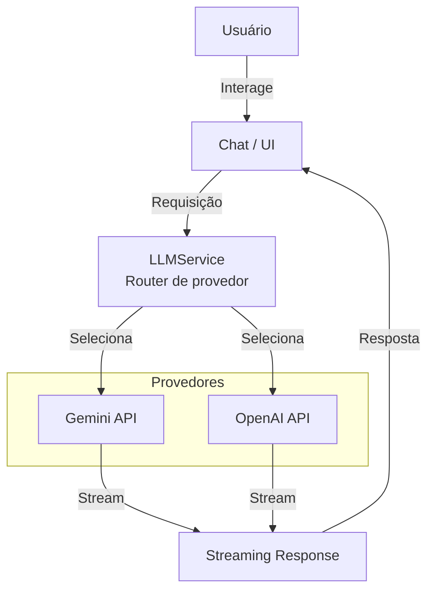

# Agente IA


**Agente IA** é uma plataforma de inteligência artificial conversacional que fornece uma galeria de agentes especialistas. Interaja com diferentes perfis criados sob medida para necessidades específicas (mentores, desenvolvedores sêniores, consultores, personal trainers e muito mais).

A aplicação permite ativar modos de raciocínio avançado, utilizar modelos conversacionais avançados e personalizar totalmente a sua experiência para qualquer desafio.

---

## 📑 Índice

- [🚀 Funcionalidades Principais](#-funcionalidades-principais)
- [🛠️ Tecnologias Utilizadas](#️-tecnologias-utilizadas)
- [🏗️ Arquitetura](#️-arquitetura)
- [📁 Estrutura de Arquivos](#-estrutura-de-arquivos)
- [🌐 Internacionalização](#-internacionalização)
- [⚡ Pré-requisitos](#-pré-requisitos)
- [🔑 Variáveis de Ambiente](#-variáveis-de-ambiente)
- [🏃 Como Executar Localmente](#-como-executar-localmente)
- [🤝 Contribuindo](#-contribuindo)
- [⚠️ Aviso Legal e Isenção de Responsabilidade](#️-aviso-legal-e-isenção-de-responsabilidade)

---

## 🚀 Funcionalidades Principais

- 👥 **Galeria de Agentes (Hub)**: Explore e ative diversos agentes com instruções (personas) minuciosamente desenhadas para serem especialistas em diferentes segmentos (TI, Direito, Investimentos, Bem-estar, etc).
- 💬 **Bate-papo Especializado**: Interface de chat rica, rápida, projetada com suporte total a **Markdown** e **realce de sintaxe em código**.
- 🧠 **Painel de Raciocínio**: Habilidade de extrair os blocos de pensamento interno (como as tags de *reasoning* de modelos LLM modernos) e exibi-los de forma elegante.
- 🌐 **Internacionalização (i18n)**: Interface traduzível para Português (pt-BR), Inglês (en) e Espanhol (es).
- 💾 **Privacidade e Armazenamento Local**: Todo o histórico de chat, configurações, e personas ficam guardados *exclusivamente* no LocalStorage do seu navegador. Inclui sistema de Exportação/Importação e Limpeza Geral.
- 🔑 **Segurança de API Keys (BYOK - Bring Your Own Key)**: Você provê sua própria chave de serviços (ex: Google Gemini API) nas Configurações, rodando o serviço diretamente pelo lado do cliente/servidor sem interceptação.
- ⚙️ **Modo Avançado UI**: Controles extras sob demanda (tokens, temperatura), barra de configurações rápidas e monitoramento de custo.

---

## 🛠️ Tecnologias Utilizadas

| Categoria | Tecnologia |
|-----------|------------|
| **Frontend Core** | [React 19](https://react.dev/), [TypeScript](https://www.typescriptlang.org/), [Vite](https://vitejs.dev/) |
| **Estilização** | [Tailwind CSS](https://tailwindcss.com/) |
| **Modelos e LLM** | SDK Oficial [`@google/genai`](https://www.npmjs.com/package/@google/genai) para Gemini Pro e Flash (`gemini-3.1-pro-preview`, `gemini-2.5-pro`) |
| **Renderização e Markdown** | `react-markdown`, `rehype-raw`, `remark-gfm`, `react-syntax-highlighter` |
| **Controle de Versão** | Git |

---

## 🏗️ Arquitetura

O projeto é uma **Single Page Application (SPA)** front-end-only, sem backend próprio. As chamadas de IA são feitas diretamente do navegador (via `GEMINI_API_KEY` do usuário).

### Fluxo de Dados



### Objetivo da Arquitetura

- **Abstração de LLM** via `services/llmService.ts` — fácil adicionar novos provedores.
- **Prompt Injection** na camada de aplicação — as personas definem comportamento por agente.
- **Compartimentalização de Sete** — `personas/`, `services/`, `components/`, `locales/`.
- **Privacidade-first** — todo o estado fica no `localStorage` do usuário; a chave API nunca é enviada a terceiros.

---

## 📁 Estrutura de Arquivos

```
Agentes-IA/
├── App.tsx                    # Estado global, fluxo de chat e prompt injection
├── index.tsx                  # Mount do React e LanguageProvider
├── types.ts                   # Interfaces, enums e tipos compartilhados
├── i18n.ts                    # Traduções e provider de idioma (pt-BR, en, es)
├── package.json
├── vite.config.ts
├── README.md
│
├── components/               # Componentes modulares de UI
│   ├── Chat/
│   │   ├── MessageBubble.tsx
│   │   ├── ChatInput.tsx
│   │   └── ReasoningPanel.tsx
│   ├── Agents/
│   │   ├── AgentHub.tsx
│   │   └── AgentCard.tsx
│   ├── SettingsModal.tsx
│   ├── TabBar.tsx
│   └── SharePanel.tsx
│
├── personas/                 # Definições de agentes e System Prompts
│   ├── developer.ts
│   ├── finance.ts
│   ├── lawyer.ts
│   └── ...
│
├── services/
│   ├── llm/
│   │   ├── gemini.ts        # Integração com Google Gemini AI (streaming)
│   │   ├── openai.ts        # Provedor mock / placeholder OpenAI
│   ├── llmService.ts        # Router de provedores
│   └── usageService.ts      # Controle de quota por modelo
│
├── locales/                  # Strings i18n
│   ├── pt-BR.ts
│   ├── en.ts
│   └── es.ts
│
├── .env.local                # Variáveis de ambiente (não commitado)
└── dist/                     # Build de produção (gerado)
```

---

## 🌐 Internacionalização

A aplicação suporta múltiplos idiomas via arquivos em `locales/`. Para adicionar um novo idioma:

1. Crie um novo arquivo em `locales/`, ex: `locales/fr.ts`
2. Adicione a chave do idioma em `i18n.ts`
3. Atualize a lista de idiomas disponíveis no componente de configurações

Idiomas suportados atualmente:
| Idioma | Código |
|--------|--------|
| Português (Brasil) | `pt-BR` |
| Inglês | `en` |
| Espanhol | `es` |

---

## ⚡ Pré-requisitos

Antes de começar, certifique-se de ter instalado:

- **Node.js** ≥ 18
- **npm** ≥ 9 (ou [pnpm](https://pnpm.io/), [yarn](https://yarnpkg.com/))
- Uma **Google Gemini API Key** ([obtenha aqui](https://aistudio.google.com/apikey))

---

## 🔑 Variáveis de Ambiente

Crie um arquivo `.env.local` na raiz do projeto. Ele é ignorado pelo git e nunca deve ser commitado:

```env
GEMINI_API_KEY=sua_chave_api_gemini_aqui
```

> ⚠️ A chave é armazenada apenas no navegador do usuário (via Configurações), nunca enviada a servidores de terceiros.

---

## 🏃 Como Executar Localmente

| Script | Comando | Descrição |
|--------|---------|-----------|
| **Dev** | `npm run dev` | Inicia o servidor de desenvolvimento Vite |
| **Build** | `npm run build` | Gera o build de produção em `/dist` |
| **Lint** | `npm run lint` | Executa type check com `tsc --noEmit` |
| **Preview** | `npm run preview -- --port 8989` | Pré-visualiza o build de produção localmente |

### Passo a passo

1. **Clone o repositório**
   ```bash
   git clone https://github.com/<usuario>/Agentes-IA.git
   cd Agentes-IA
   ```

2. **Instale as dependências**
   ```bash
   npm install
   ```

3. **Configure a variável de ambiente**
   ```bash
   cp .env.example .env.local   # ou crie .env.local manualmente
   # Edite .env.local e adicione sua GEMINI_API_KEY
   ```

4. **Execute o ambiente de desenvolvimento**
   ```bash
   npm run dev
   ```

5. **Abra a aplicação** no navegador usando o link fornecido pelo Vite (geralmente `http://localhost:5173`). Clique na engrenagem de "Configurações" e insira sua API Key.

---

## 🧪 Scripts Disponíveis

| Comando | Propósito |
|---------|-----------|
| `npm run dev` | Servidor de dev com HMR (Hot Module Replacement) |
| `npm run build` | Build de produção (minificado, sem sourcemaps por padrão) |
| `npm run lint` | Verificação de tipos TypeScript sem emissores |
| `npm run preview` | Servidor estático de preview do build em porta customizada |

---

## 🔧 Troubleshooting

| Problema | Causa Comum | Solução |
|----------|-------------|---------|
| `GEMINI_API_KEY não encontrada` | `.env.local` ausente ou mal configurada | Crie `.env.local` com a chave válida |
| Erro de CORS | Chave inválida ou IP bloqueado pela Google | Verifique o ID da chave em [Google AI Studio](https://aistudio.google.com/apikey) |
| Chat não exibe mensagens | `LocalStorage` bloqueado no navegador | Verifique permissões do navegador ou use abas sem restrições (incognito) |
| Erro ao compilar | Dependências desatualizadas | Rode `rm -rf node_modules && npm install` |
| Modal de configurações não abre | Script de HMR com conflito | Cmd+Shift+R (Mac) / Ctrl+Shift+R (Windows) |

---

## 🤝 Contribuindo

Contribuições são bem-vindas! Siga o fluxo abaixo:

1. Fork o projeto
2. Crie uma branch para sua feature:
   ```bash
   git checkout -b feature/minha-nova-funcionalidade
   ```
3. Faça commit das alterações:
   ```bash
   git commit -m "feat: adiciona nova funcionalidade X"
   ```
4. Push para a branch:
   ```bash
   git push origin feature/minha-nova-funcionalidade
   ```
5. Abra um Pull Request detalhando as mudanças

### Convenções de commit

Usamos mensagens no estilo [Conventional Commits](https://www.conventionalcommits.org/):

| Tipo | Uso |
|------|-----|
| `feat:` | Nova funcionalidade |
| `fix:` | Correção de bug |
| `docs:` | Apenas documentação |
| `style:` | Formatação sem mudança de lógica |
| `refactor:` | Refatoração de código |
| `test:` | Adição ou alteração de testes |
| `chore:` | Ajustes de build, dependências, CI |

---

## ⚠️ Aviso Legal e Isenção de Responsabilidade (Disclaimer)

Este projeto é fornecido "COMO ESTÁ" (as is), sem garantias de qualquer tipo, expressas ou implícitas. Ao clonar, fazer fork, hospedar ou modificar este repositório, você assume total e exclusiva responsabilidade sobre o uso do código e das integrações de API.

Os criadores originais e contribuidores deste repositório **NÃO** se responsabilizam por:
- Uso indevido da plataforma ou infrações aos Termos de Serviço de APIs de terceiros (como Google Gemini, OpenAI, etc).
- Custos, cobranças ou vazamento de chaves de API causados por hospedagem incorreta ou má gestão por parte de quem fez o fork.
- Modificações nos *prompts* (personas) originais que resultem em respostas prejudiciais, falsas, ofensivas ou perigosas (como remover os alertas médicos/financeiros).
- Quaisquer danos diretos ou indiretos resultantes do uso ou da incapacidade de usar este software.

Qualquer versão modificada deste software deverá ser tratada de forma completamente independente, e a responsabilidade de auditar a segurança e conformidade legal de alterações recairá exclusivamente sobre o autor das modificações.
